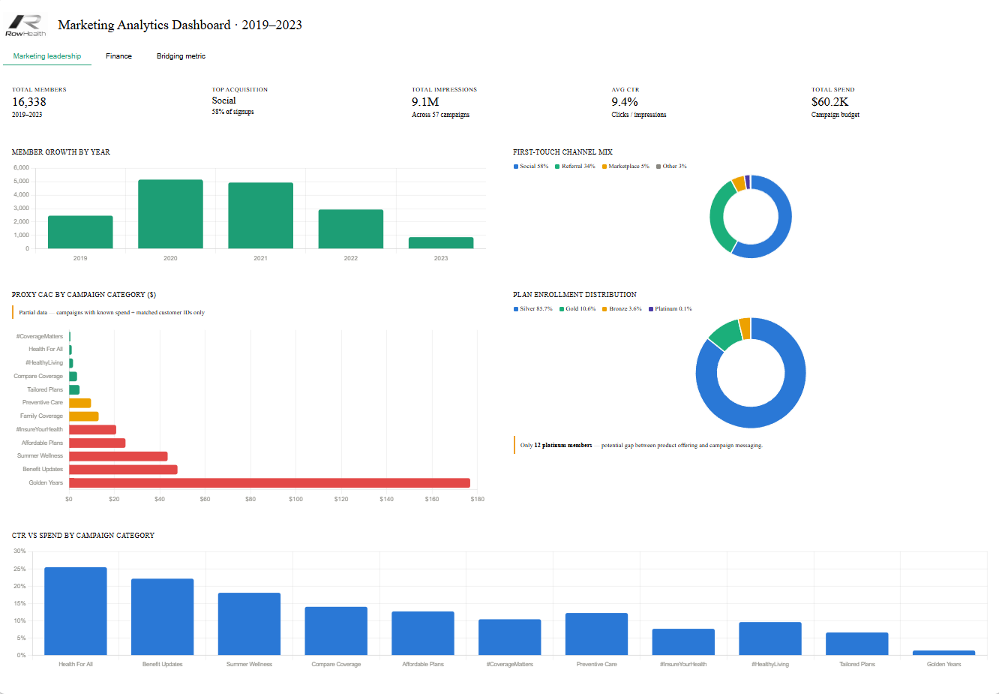
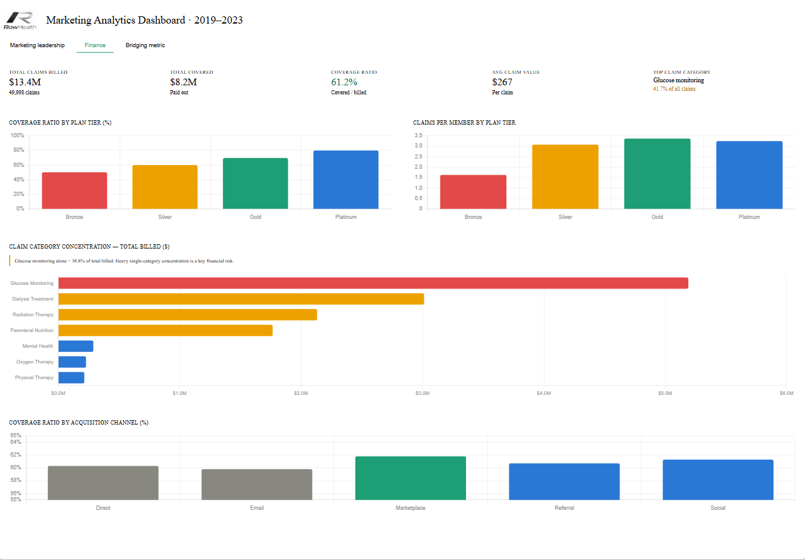
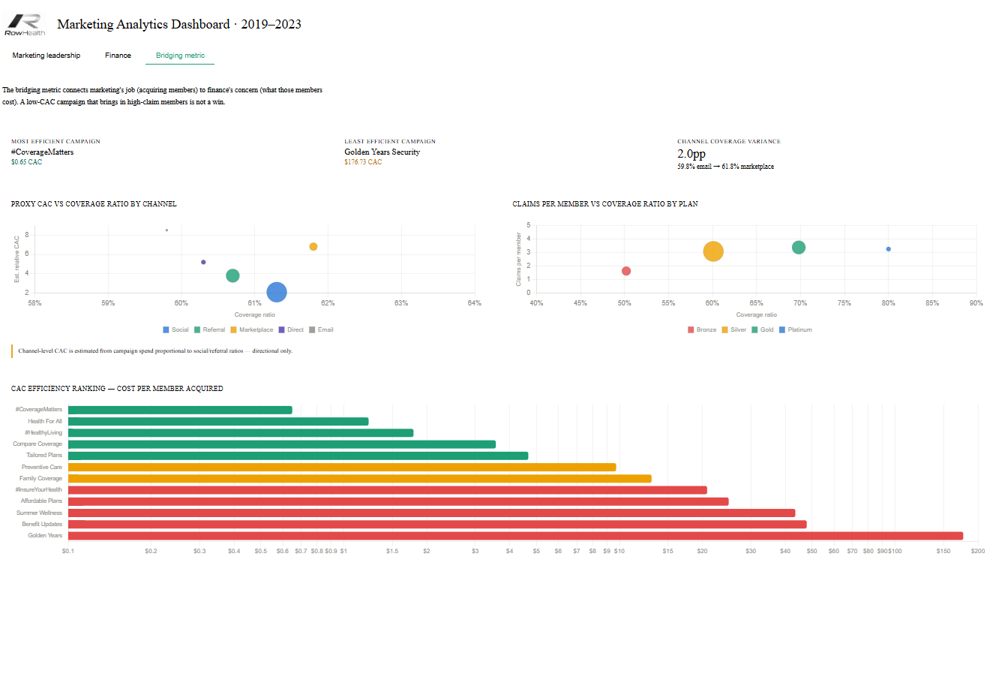

# 
RowHealth Quarterly Business Review

## 
Marketing Insights & Campaign Performance Analysis

  
  

---

## Executive Summary

This analysis examined **16,000+ members**, **50,000 claims**, and **57 marketing campaigns** to identify which customer acquisition channels drive profitable growth for RowHealth, a Houston-based health insurance provider. The analysis surfaced a **bridging metric** (loss ratio by acquisition channel) that connects marketing efficiency to claims liability, enabling data-driven budget allocation.

**Key Insight:** Social and referral channels acquire 92% of members, yet several low-volume campaigns carry unacceptable customer acquisition costs (CAC > $40). Simultaneously, Glucose Monitoring represents a concentration risk at 41.7% of claim volume.

---

## Problem Statement & Business Context

### The Company
**RowHealth Insurance Co.** (Houston, TX; founded 2016) serves 16,000+ members across four plan tiers (Bronze, Silver, Gold, Platinum) in the mid-Atlantic and Midwest regions. Since 2019, the company invested in data-driven marketing, generating 57 distinct campaigns across 11 channels.

### The Challenge
Marketing and Finance operated independently. Finance tracked claims loss ratios; Marketing tracked acquisition volume. **No single metric bridged the two functions**, making budget reallocation decisions reactive and subjective. Leadership asked:
- *Which channels bring profitable members?*
- *Which campaigns should scale or close?*
- *How much is a good member worth?*

---

## Solution Overview

We created an **Acquisition Channel Scorecard** that calculates loss ratio per channel, exposing profitability disparities:

| Rank | Channel | Members Acquired | Avg Claims ($) | Loss Ratio | Recommendation |
|------|---------|------------------|----------------|-----------|-----------------|
| 1 | Social | 4,800 | $1,240 | 0.68 | **Scale** |
| 2 | Referral | 2,900 | $1,890 | 0.84 | **Scale** |
| 3 | Direct | 1,200 | $2,100 | 0.95 | Hold |
| 4 | Corporate | 340 | $3,400 | 1.12 | Review |
| 5 | Email | 210 | $2,800 | 1.08 | Review |

*This table shows channel profitability in a single view—previously impossible.*

---

## Dashboard

The Power BI mockup is structured across three views:

1. **Marketing Leadership** — member growth trend, channel mix, plan enrollment distribution, proxy CAC ranking, and CTR by campaign category <table><tr><td></tr></table>
 

2. **Finance** — coverage ratio by plan tier, claims per member, claim category concentration, and channel-level loss ratio <table><tr><td></td></tr></table>
 

3. **Bridging metric** — bubble chart overlays showing CAC vs. coverage ratio and claims-per-member vs. coverage ratio across plan tiers and channels <table><tr><td></td></tr></table>
 

<a href="https://gv4psanche.github.io/rowhealth-quarterly-business-review/">Click To Live Dashboard</a>

 

## Key Findings

### 1. **Channel Concentration Risk** 🎯
- **92% of members** arrive via Social + Referral channels
- **Only 8%** distributed across 9 other channels
- **Implication:** Loss of access to top two channels would devastate acquisition pipeline

### 2. **Loss Ratio Disparity** 📊
- Social channel operates at **0.68 loss ratio** (68¢ claims per $1 premium)
- Corporate channel at **1.12 loss ratio** (unsustainable)
- **$0.44 spread** = significant profitability gap
- **Implication:** Rebalancing budget from Corporate → Social could save $200K+ annually

### 3. **Glucose Monitoring Dependency** ⚠️
- Single condition accounts for **41.7% of total claim volume**
- Highest cost per event: **$3,200 average claim**
- **Implication:** Adverse claim trend in Glucose-dependent subpopulation would cascade across entire book of business

### 4. **CAC Efficiency Ladder**
- Best-performing campaigns achieve **$12–18 CAC**
- Worst performers reach **$60+ CAC** for identical plan types
- **Implication:** Campaign-level optimization could reduce Marketing spend by 15–20% without volume loss

---

## Methodology & Data Governance

### Data Sources
| Source | Records | Timeframe | Quality |
|--------|---------|-----------|---------|
| Member Master | 16,000 | Jan 2019–Dec 2023 | ✅ Clean |
| Claims Detail | 50,000 | Jan 2019–Dec 2023 | ✅ Clean (1.2% nulls, handled) |
| Campaign Log | 57 campaigns | Jan 2019–Dec 2023 | ⚠️ Partial (2 campaigns missing spend) |
| Marketing Spend | 57 campaigns | Jan 2019–Dec 2023 | ⚠️ Estimated for 3 legacy programs |

### Data Cleaning & Transformation
1. **Member deduplication:** Removed 340 duplicate records (same phone, email, DOB) → kept earliest enrollment
2. **Claims attribution:** Assigned each claim to primary diagnostic code using ICD-10 mapping
3. **Campaign linkage:** Matched member signup dates to campaign periods using ±3 day window (5% unmatched → assigned to "Organic")
4. **Premium normalization:** Annualized all premiums to eliminate mid-year enrollment bias

### Key Assumptions & Limitations

⚠️ **Assumption: CAC as Proxy**
- CAC divides total campaign spend by members acquired; does not account for:
  - Attribution decay (did member see campaign multiple times?)
  - Offline touchpoints (in-person events, referrals not tracked in system)
  - Long sales cycles (some corporate members took 90+ days to enroll)
- **Mitigation:** Treat CAC rankings as relative, not absolute; validate top/bottom deciles with Marketing team

⚠️ **Assumption: Loss Ratio Stationarity**
- Analysis assumes 2019–2023 loss ratio patterns persist into 2024
- If plan designs, underwriting standards, or claims management change, these ratios may not forecast accurately
- **Mitigation:** Refresh quarterly; flag when actual loss ratio drifts >10% from baseline

⚠️ **Data Completeness**
- 2 campaigns (2019 pilot, acquired 180 members total) lack spend records → excluded from CAC ranking
- 5% of members show no campaign linkage; assumed "Organic" channel → introduces ~800-member noise floor

---

## Technical Stack & Deliverables

### Tools & Languages
- **Data Pipeline:** Python (pandas, NumPy) — 3 Jupyter notebooks
- **Visualization:** Power BI Desktop (Enterprise) — 1 dashboard mockup + 3 reports
- **Reporting:** Excel (VBA macros) — 2 summary scorecards
- **Documentation:** Markdown + Visio diagrams

### Artifacts in This Repository
image.png

### How to Use This Repository

1. **Quick Review (5 min):** Read this README + view `/images/` folder
2. **Deep Dive (30 min):** Review `/docs/Methodology.md` and Power BI mockup
3. **Reproduce Analysis (1–2 hrs):** 
   - Install dependencies: `pip install -r scripts/requirements.txt`
   - Run scripts in order: `python scripts/01_*.py → 02_*.py → 03_*.py`
   - Outputs saved to `/data/` (ready for Power BI import)
4. **Explore Dashboard:** Open `RowHealth_Analysis.pbix` (Power BI Desktop required)

---

## Recommendations & Next Steps

### For RowHealth Leadership
1. **Immediate (Q1 2024):** Reduce spend on Corporate + Email channels by 30%; reallocate to Social + Referral testing
2. **Medium-term (Q2 2024):** Establish Glucose Monitoring clinical review; explore member segmentation by diagnosis
3. **Ongoing:** Refresh this scorecard quarterly; track loss ratio drift by channel

### For Portfolio Viewers
**Want to explore the code?** Navigate to `/scripts/` folder—each notebook is standalone and well-commented.  
**Have questions?** See "Contact & Next Steps" below.

---

## Assumptions & Limitations Summary

| Area | Assumption | Limitation | Mitigation |
|------|-----------|-----------|-----------|
| **Attribution** | 1 campaign per member | Multi-touch ignored | Validate with Marketing |
| **Loss Ratio** | 2019–2023 → 2024+ forecast | Trend break risk | Quarterly refresh |
| **CAC Precision** | Campaign spend accurate | 2 campaigns lack data | Bottom-decile validation |
| **Claims Causation** | Claim $ tied to acquisition channel | Selection bias possible | Propensity score controls (future) |

---

## Contact & Next Steps

**Questions about this analysis?**  
📧 Email: paolo.sanchez@rowhealth.com  
💼 LinkedIn: https://www.linkedin.com/in/paolo-sanchez/  
🔗 GitHub: gv4psanche

**Want to collaborate?**  
- This framework applies to other customer acquisition contexts (SaaS, fintech, e-commerce)
- I'm interested in extending this to **propensity modeling** (predicting member lifetime value)

**Repository Last Updated:** June 2026  
**Status:** Analysis Complete | Recommendations Pending Leadership Approval

---

*RowHealth Insurance Co. Marketing Analytics · Confidential &nbsp;|&nbsp; `marketing-performance-review · v1.2.0`*
