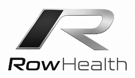
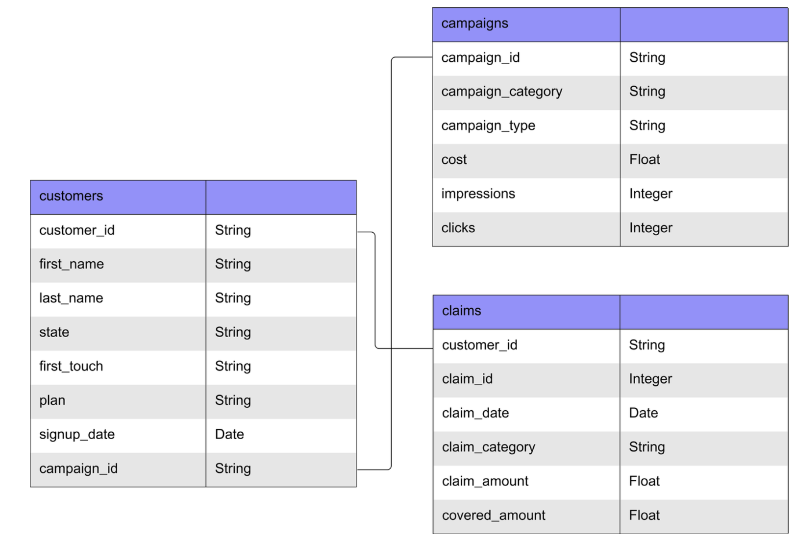

<!--  -->

# 
Member Care Plan and Claims Analysis (QBR)

A marketing analysis of patient care plans and claims performance

<b>Period:</b> 2019 – 2022 &nbsp;|&nbsp; <b>Team:</b> Data Analytics &nbsp;|&nbsp; <b>Updated:</b> Apr 2023 &nbsp;|&nbsp; <b>Tools:</b> Excel/Power BI

---

**Quick Overview**

**Founded in 2016, Row Health is a medical insurance company serving thousands of customers throughout the United States**. **In 2019, they launched a new set of marketing campaign categories** spanning topics like wellness tips, the affordability of their plans, and preventative care. Their customers can sign up for 4 different plans - bronze, silver, gold, and platinum - each with different premiums and claim coverage rates. 

Now that they’ve hired a new data team and are strategizing their marketing budget for the year, the company would like to build more understanding of the effectiveness of these campaign categories and how they relate to signups and subsequent patient claims. **As a data analyst at Row Health, your focus is on building visualizations** to enable the marketing team to self-serve insights and regular-cadence reporting.

# Visuals #
** Visuals Placeholder **

# Insights #
** Insights Placeholder **
 - insight #1
 - insight #2
 - insight #3

# Recommendations #
** Recommendation Placeholder **
  - recommendation #1
  - recommendation #2
  - recommendation #3

*Bits&Bytes Commerce Inc. · Revenue Analytics · Confidential &nbsp;|&nbsp; `sales-performance-review · v1.2.0`*

 

---

## About The Project 

### Company 
**RowHealth is a Houston, Texas-based private health insurance company founded in 2016**, dedicated to making quality healthcare coverage accessible and affordable across the United States. With a team of 250–500 employees, RowHealth has grown to serve over 16,000 members nationwide — with a particularly strong presence in New Jersey, New York, and the broader mid-Atlantic and Midwest regions. Members can choose from four tiered plan offerings — Bronze, Silver, Gold, and Platinum — designed to match a range of healthcare needs and budgets, with the Silver plan being the most widely adopted.

Since 2019, RowHealth has invested heavily in data-driven marketing to expand its reach and member education. Spanning categories such as wellness tips, preventive care, plan comparisons, and affordability messaging, the company's campaigns have generated over 9 million impressions and more than 850,000 clicks — demonstrating strong engagement across digital and social channels. Social media and referrals are the two leading acquisition channels, reflecting the trust RowHealth has built within the communities it serves. The company's campaigns are thoughtfully tailored — ranging from seasonal wellness content to policy information and customer testimonials — reinforcing its commitment to transparency and member empowerment.

On the claims side, RowHealth has processed nearly 50,000 claims totaling over $13 million in billed services, covering approximately 61% of those costs for members. The breadth of covered services — from glucose monitoring and physical therapy to mental health counseling and radiation therapy — underscores RowHealth's commitment to comprehensive, whole-person care. As the company continues to scale, it remains focused on delivering plan flexibility, proactive health engagement, and meaningful coverage to its growing member base.

### Operational Data 
**RowHealth’s** current book of business encompasses nearly **16,000 members** and more than **50,000 claims**, yielding a total billed services exceeding **$13M USD**. The accompanying Patient Member dataset provides comprehensive data across multiple dimensions, including patient member information, claims transactions, and campaign program engagement.  

  
 RowHealth Entity Relationship Diagram (ERD)

 

**Note:**  "*add work here*" dataset. See [EDA process](/doc/RH_EDA.pdf) on how the dataset was cleaned and prepared for this analysis.

 ### The Ask 
After their successful 2019 marketing campaign launch, the company has generated over data comprising 9 million impressions and more than 850,000 clicks. The Marketing team is strategizing their marketing budget for the year and would like to build better understanding of the effectiveness of these campaign categories and how they relate to signups and subsequent patient claims. The data team has been asked to build visualizations to enable the marketing team to self-serve insights and regular-cadence reporting:
 
#### Northstar Metrics
* **Sales trends** - Focusing on key metrics of sales revenue, number of orders placed, and average order value (AOV).
* **Product performance** - Analyzing different product lines, market impact, and refund rates to inform strategic product decisions.
* **Loyalty program evaluation** - Evaluating the effectiveness of the company's loyalty program and providing recommendations to maximize customer engagement and retention.
* **Regional results** - Evaluating regional demand and product performance within regions to identify areas for improvement.

### Assumptions  
* **Backdated Analysis** - This analysis reporting assumes that the present year is 2023 and the data for review is from the prior 4 years of 2019-2022.
* **Rough Data** - The dataset is assumed to have been pulled together from older system app sources which explains the "not so clean" state.
* **Missing Returns/Refund Data** - The hypothetical cause for the missing returns data for the period Q1-Q3 2023 was due to a major systems issue that resulted in the non-capture of returns transactions.

[Back to Sales Performance Review](#sales-performance-review)

---

  

